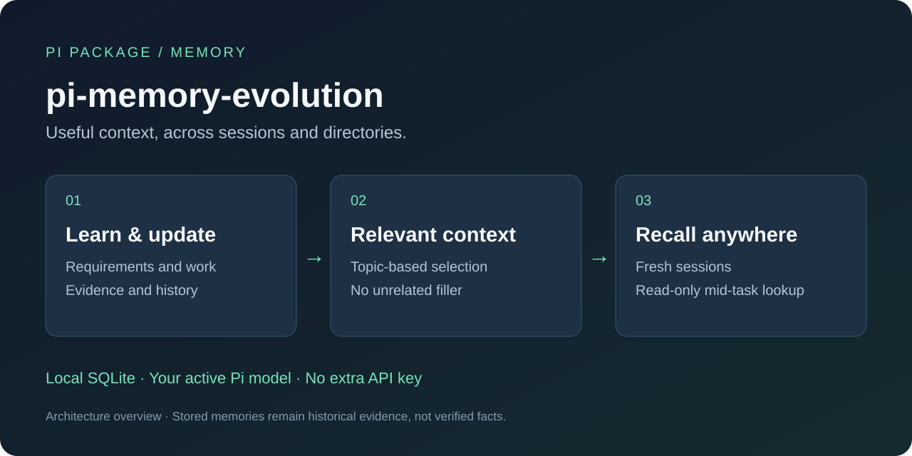

# pi-memory-evolution

[](https://github.com/btnalit/pi-memory-evolution/actions/workflows/ci.yml)
[](https://www.npmjs.com/package/pi-memory-evolution)
[](LICENSE)

English · [简体中文](README.cn.md)

Persistent, evidence-aware memory for [Pi](https://pi.dev). Keep useful preferences,
project context and work progress across sessions—without repeatedly asking the
assistant to remember them.



## Features

- **Learn and update automatically.** Capture requirements, corrections and compaction
  summaries. Update tracked project states from tool observations, with provenance,
  history, gradual decay and evidence-aware ranking.
- **Inject relevant context.** Select memories by the current topic and recent user
  context. Filter weak or stale matches; no relevant match means no unrelated filler.
- **Recall across sessions.** Find background from another session or directory.
  A read-only `memory_recall` tool lets the assistant look up missing context mid-task.

Learning uses Pi's active model and existing authentication. No separate API key,
embedding service or vector database is required.

## Install

Requires **Pi 0.85+** with a working model. npm-based Pi requires **Node.js 22.19+**.

```bash
pi install npm:pi-memory-evolution
```

Or install the Git default branch, with Git and npm available locally:

```bash
pi install https://github.com/btnalit/pi-memory-evolution
```

Choose **one** source, then run these commands inside Pi:

```text
/reload
/memory status
```

`SQLite ok (schema 5)` confirms storage initialization. Continue using Pi normally;
learning and recall run automatically.

## Use

Describe your requirements in a conversation:

```text
Our priorities for atlas-service are automatic backups and reliable recovery.
```

Later, in a fresh session sharing the same memory store:

```text
What do you remember about atlas-service's priorities?
```

Learning is asynchronous and selective—not every message becomes a memory.

| Command | Purpose |
| --- | --- |
| `/memory list` | Browse memories |
| `/memory search <topic>` | Search relevant claims |
| `/memory show <id>` | Inspect content and evidence |
| `/memory learning` | Inspect capture and actual update results |
| `/memory explain` | Explain the last automatic injection |
| `/memory correct <id> <text>` | Correct a record |
| `/memory forget <id>` | Suppress a record from recall |

See the [usage guide](docs/usage.md) for all commands, migration and troubleshooting.

## Update or uninstall

For the npm installation:

```bash
pi update npm:pi-memory-evolution
pi remove npm:pi-memory-evolution
```

For Git, substitute the repository URL used during installation. Reload or restart
Pi afterward. Uninstalling does not delete memory data. Before a schema-changing
upgrade, stop Pi processes sharing the database and back up the state directory.

## Data and limits

Local SQLite state lives in `~/.pi/agent/agent-suite/memory-evolution/`.
`PI_CODING_AGENT_DIR` changes that prefix; different working directories share the
same store by default.

Learning sends filtered source content to the active model and consumes its quota.
Memories are historical evidence, not independently verified facts. Matching and
secret filtering are imperfect; verify important claims. See [privacy and storage](docs/usage.md#local-storage-and-provenance).

## Development

```bash
npm ci --ignore-scripts
npm run check
npm run test:install
npm run test:pi
npm run build
```

CI checks types, regressions, package contents, installation and fake-model host
integration. Builds produce an installable npm archive and checksums, not a separate
compiled runtime. Release PRs automate versions and changelogs; merging a verified
release PR triggers npm publication. Dependency updates arrive as gated PRs.

See [testing](docs/testing.md) and [release automation](docs/releasing.md).

## Documentation

[Usage](docs/usage.md) · [Architecture](docs/design.md) · [Memory quality](docs/core-quality.md) · [Changelog](CHANGELOG.md)

## License

[MIT](LICENSE)
