# Pi Memory Evolution — 记忆自进化系统方案

> 版本：0.2（评审后修订）
> 日期：2026-08-04
> 状态：已按评审结论修订

### v0.2 变更记录（2026-08-04 评审后）

- 修正 5.2 事件钩子清单：移除 `session_before_compact`（多扩展冲突，见问题 1），改用 `session_compact`（纯观测）+ 新增 `agent_end`（记忆评估）
- 4.8 注入器：补充子代理进程（`isChildSubagentProcess`）跳过逻辑
- 4.3 信号采集：补充触发策略（首次 `session_compact` 后启动、每次 `agent_end` 增量、积累 3 个会话后评估）
- 4.4 记忆评估：明确触发时机
- 6.1 依赖面：明确 import 边界（允许公开入口，禁止内部路径与 pi-agent-suite 模块）
- 第 10 节风险：补充 `session_before_compact` 误注册风险
- 第 11 节开放问题：原 5 个问题全部给出评审结论，剩余 3 个新问题

---

## 1. 背景与目标

### 1.1 现状（事实）

Pi agent 的记忆系统是五层结构：

1. 持久存储：会话按工作目录分桶存 JSONL（`~/.pi/agent/sessions/<cwd>/<时间戳>_<uuid>.jsonl`），append-only，带 id/parentId 树状结构
2. 上下文投影（context-projection）：剩余 token 低于 70k/50k/30k 时，把大工具结果替换为摘要（4000/2000/1000 tokens 门槛递增），最近 10 轮（20%）保持完整
3. 自适应压缩（custom-compaction）：`session_before_compact` 事件触发，分块总结 + 结构化摘要（goal/progress/collaboration_desk/subagents_history/assumptions/open_questions/next_steps），增量更新，失败 fallback 到原生压缩
4. 系统提示协议：`<content_compaction>` 要求压缩后回源重读文件、SKILLS.md、desk 消息；`<skills_management>` 要求压缩后重读技能
5. 外部记忆：项目文件、SKILLS.md、project-rules（`.pi/rules` 自动注入）、team-mcp desk（版本化持久化）、MCP 工具 schema 缓存

### 1.2 问题（评估结论）

记忆闭环是：**记忆 → 使用 → 评估 → 调整 → 记忆**。当前系统只有前半段（记忆 → 使用），后半段缺失：

- 无记忆质量评估：压缩/投影后没有验证关键事实是否保留
- 无利用度反馈：不知道哪些记忆被使用、哪些被重跑取回、哪些从不被引用
- 无策略学习：阈值、摘要格式、保留规则全是静态配置
- 无结构进化：系统不会写自己的规则文件、不会调整系统提示
- 跨会话断链：压缩摘要不落盘，不自动进入下一个会话

### 1.3 参考项目

Hermes Agent 的 self-evolution-governor（https://github.com/btnalit/hermes-self-evolution）提供了闭环可行性证明。经评估，借鉴其三个核心优点，舍弃三个过度设计：

**取：**

1. 代码级注入 > 提示词协议：runtime_digest 通过 `prompt_builder.py` 代码钩子注入每个会话，而不是靠 SOUL.md 让模型"记得去看"——软协议必然被跳过
2. "时间不是证据"：议程成熟度评分以证据强度为主，时间只是 log 衰减加成；存在久 ≠ 重要
3. 治理层：speak gate（配额 + 决策可追溯）+ 用户批准边界 + ops-gate 执行边界，防止自进化变成噪音或失控

**舍：**

1. 12 步 cron 流水线：pi 用事件钩子即可，不需要独立编排
2. 全量信号采集器：pi 的会话 JSONL、投影记录、desk 消息就是现成信号源
3. MkDocs 控制台：过度工程

### 1.4 核心约束（用户要求）

**插件化，最小化 pi 版本升级影响。** 一切功能以 pi 扩展形式存在，不修改 pi 核心代码。设计上必须与 pi 版本解耦。

---

## 2. 设计原则

| 编号 | 原则 | 含义 |
|---|---|---|
| P1 | 插件化 | 所有能力通过 `pi.extensions` 声明的扩展实现，零核心补丁 |
| P2 | 版本解耦 | 只依赖稳定的公开 ExtensionAPI；pi API 调用集中在适配层；升级只改适配层 |
| P3 | 证据驱动 | "时间不是证据"。记忆评估、议程成熟、提案评分都以证据强度为主 |
| P4 | 治理优先 | 任何自进化动作必须先过 speak gate + 批准边界；只读观察自动，写操作需批准 |
| P5 | 无噪音 | 信号驱动，无信号即沉默。禁止硬编码默认优先级（Hermes 的真实教训） |
| P6 | 失败降级 | 任何机制失败 → 静默跳过，绝不影响 pi 正常会话 |
| P7 | 状态独立 | 状态文件放扩展自有目录，不侵入 pi 的 sessions/、models-store.json、settings.json |

---

## 3. 架构总览

```mermaid
flowchart LR
    A[Signal sources<br/>session JSONL / projection / desk / user feedback] -->|collect| B[Signal store<br/>signals.jsonl append-only]
    B -->|feed| C[Memory auditor<br/>quality + utilization scoring]
    C -->|evidence| D[Agenda engine<br/>maturation over time]
    D -->|mature candidates| E[Governor<br/>speak gate + proposal state machine]
    E -->|approved| F[Evolution executor<br/>write rules / adjust config]
    F -->|persist| G[Evolution store<br/>rules / digest / journal]
    G -->|inject via before_agent_start| H[Next session context]
    H -->|produces| A
```



四层职责：

- **信号层**：从 pi 现有产物中采集结构化信号（会话、投影、压缩、desk、用户反馈）
- **评估层**：记忆质量评分、利用度统计、议程成熟度
- **治理层**：speak gate（该不该说）、提案状态机（该不该做）、批准边界
- **进化层**：把批准的改进写回规则文件/状态文件，经注入影响下个会话

---

## 4. 模块设计

### 4.1 扩展入口（index.ts）

- 通过 `package.json` 的 `pi.extensions` 声明，导出 `default function(pi: ExtensionAPI)`
- 注册全部事件钩子（见第 5 节）
- 启动时做版本/能力探测，缺失能力降级（见第 6 节）

### 4.2 适配层（adapter/）— 版本解耦核心

- 定义本扩展自己的接口：`SessionInfo`、`CompactEvent`、`PromptContext` 等
- pi 的 `ExtensionAPI` 调用全部收口在 adapter 文件内
- 功能：
  - 版本探测：读取 pi 版本号 / 探测 API 存在性
  - 事件映射：pi 事件名 → 本扩展内部事件
  - 能力降级：某能力不可用时返回"不可用"，调用方静默跳过
  - 防御性调用：所有 pi API 调用 try/catch，异常不向上抛

### 4.3 信号采集（signals/）

信号源全部来自 pi 现有产物，不新增采集器：

| 信号 | 来源 | 采集方式 |
|---|---|---|
| 会话长度/轮数 | sessions/*.jsonl | 读取会话文件统计 |
| 投影触发次数 | 会话 JSONL 中的投影提示 | 正则扫描 "Result omitted" |
| 工具结果重跑率 | 会话 JSONL | 统计"重新运行工具取回全文"的频率（利用度信号） |
| 压缩发生/结果 | custom-compaction 的 TUI 条目 | 事件或文件扫描 |
| 用户纠正 | 会话 JSONL user 消息 | 轻量文本分析（纠正词频） |
| 配置变更 | agent-suite 配置、settings.json | mtime + diff |
| 跨 agent 活动 | team-mcp desk | 读取 desk 消息统计 |
| 记忆质量基线 | 记忆评估结果 | 评估层输出回流 |

输出：`signals.jsonl`（append-only，与 pi 会话文件同构）。

**触发策略**（v0.2 评审补充）：

- 首次触发：至少发生 1 次 `session_compact` 后才启动信号采集——新会话无历史数据，过早采集样本不足
- 后续触发：每次 `agent_end` 增量采集（只读本会话新增部分）
- 评估启动：积累 3 个会话数据后开始记忆评估（与 shadow mode 校准期一致）
- 子代理进程：`isChildSubagentProcess()` 为真时跳过全部采集（子代理上下文不应污染主信号流）

### 4.4 记忆评估（auditor/）

- **质量维度**（Hermes 成熟度公式移植）：
  - `maturity_score = 0.30×evidence_strength + 0.25×trend_strength + 0.20×recurrence_density + 0.15×unresolved_cost + 0.10×actionability + time_pressure_bonus − staleness_penalty`
  - `time_pressure_bonus = min(0.12, log(days+1) × 0.03)`——时间不是证据
  - **contribution（P8 已填充）**：`contribution = weight × relevance`（信号强度 × 与议程相关度，Hermes signal_weight 语义对齐）；evidence_strength 分子直接读 contribution 求和（不再硬编码 0）
- **利用度维度**（pi 特有）：
  - 投影后重跑率（高 = 摘要丢了关键信息，投影阈值应调低）
  - 回源重读执行率（压缩后是否真的重读了文件——检测软协议执行情况）
  - 摘要引用率：**不可观测**（模型内部对摘要内容的使用无外部痕迹，无法从任何文件推断），已排除不实现
- **触发时机**：`agent_end`（每次会话结束时做会话级统计）+ 每日聚合（可选，依赖会话节奏）
- **输出**：记忆健康报告 → 议程引擎 + 注入 digest

### 4.5 议程引擎（agenda/）

- 长期议程项：`strategic_positioning`（问用户）、`automation_opportunity`（提案）、`risk_watch`（绕过成熟直接报警）、`quality_improvement`（提案）、`cleanup_candidate`（digest 提示）
- 状态机：`observing → accumulating_evidence → candidate_ready → surfaced → resolved → archived`
- 阈值默认参照 Hermes：min_score 0.72、min_evidence 3、min_observation_days 3、cooldown 7 天、auto_archive 21 天
- 首次部署进 shadow mode：只计算和记录，不触发任何动作，2-3 天校准后再接入（Hermes V1.4 经验）

### 4.6 治理层（governor/）

**speak gate**（该不该打扰用户）：

- 评分：`speak_score = (impact×0.40 + recurrence×0.25 + confidence×0.35) × risk_dampener + bonuses − interruption_cost − repeat_penalty`
- 风险阻尼：none 1.00 / low 0.97 / medium 0.82 / high 0.55 / critical 0.00（critical 只报警不动作）
- 配额：每天最多 3 条建议、1 条战略反思；配额耗尽降级到 proposal queue
- 可追溯：每个决策输出 `decision_reason` 步骤数组 + `would_have_spoken_without_quota`（区分"质量不够"和"容量不够"）
- 输出动作：`speak_now` / `speak_now_with_approval` / `proposal_queue` / `daily_digest` / `silent_log_only` / `risk_alert_only`

**提案状态机**（P5 已实施自动审批，P6 已实施 verified 信号 + 词边界加固）：

```
pending_user_approval → approved | rejected   (agent 消息引用提案 id + 批准/拒绝关键词)
pending_user_approval → rejected               (expires_at 到期未决策)
approved → implemented                          (执行器生成执行计划文件)
approved → rejected                             (手动/未来)
implemented → verified | failed | rollback_required   (verified：agent 消息 + 验证关键词)
failed → rollback_required
```

- 终态：`verified` / `rejected` / `rollback_required`；`draft` 保留供未来非交互路径
- 审批窗口：创建时设定 `expires_at = createdAt + 24h`（Hermes 对齐）；无定时器，到期检查在 `agent_end` 事件边界完成
- 审批通道：digest 的「Proposals Awaiting Approval」section 呈现待审提案（id/标题/expiry）；主 agent（LLM）在会话中引用提案 id 表达批准/拒绝，扩展在 `agent_end` 分析消息捕捉决策
- 保守匹配（P6 加固）：仅“提案 id + 明确关键词”触发决策；英文关键词词边界匹配（`approved`/`token`/`okay` 不误命中）；否定形态优先（`不执行`/`不批准` 判定拒绝，不因含 `执行`/`批准` 而误判）；矛盾表达（批准+拒绝词同现）→ 不决策，留给到期拒绝
- verified 信号（P6）：implemented 提案由 agent 消息 + 验证关键词（`已验证`/`验证通过`/`verified`/`verification passed`）推进到 verified；本轮新 implemented 的提案下轮才可验证（需执行结果）
- 安全论证：执行器是 record-first（只产出执行计划文件），审批/验证误判风险有限（多/少一份计划文件，无行为副作用）

**安全边界**（写死，不靠提示词）：

- 自动允许：观察、统计、起草提案、写本地 journal、更新 signals
- 必须用户批准：写/改规则文件、改记忆、改配置、创建/删除技能、重启服务
- 所有可执行变更走 `pre_execution_design` 阶段（仿 ops-gate），禁止直接执行

### 4.7 进化执行器（executor/）

**P5 落地：record-first 执行**（pi 0.84.1 实测无 project-rules `rulesDir` API，原“写回共享 rules 目录”假设修正为以下方案）：

- 批准的提案 → 生成 markdown 执行计划文件到 `executions/P-<id>.md`（本扩展自有目录）
- 每个执行计划带：变更描述、`rollback` 方案、`verification` 方法、证据路径（Hermes 模板字段移植）、手动执行 checklist
- **证据路径（P6）**：候选携带真实证据记录（pipeline 从议程项贯通），执行计划 Evidence section 引用真实收集的证据，不再恒为空
- 真实行为变更保持手动：用户在扩展外按执行计划操作（不自动写配置/规则，安全边界不破）
- 单提案写失败 → `failed`（journal 记录原因），其余提案继续执行；无 approved 提案 → 静默
- **归档（P6）**：终态提案（verified/rejected/rollback_required）的执行计划移入 `executions/archive/`（journal 记录），保留 90 天后自动清除；implemented 的计划不归档（用户可能仍在手动执行）
- 触发时机：`agent_end`（speak gate → 自动审批 → 验证信号 → 执行器 → 归档，同一事件边界）
- 未来若 pi 暴露 rules 写入能力：可探测后升级为自动写回（探测式能力升级，不破坏现有流程）

### 4.8 注入器（injector/）— 闭环的"输出"端

- 用 `before_agent_start` 事件修改 systemPrompt，注入 `runtime_digest`（当前焦点、待决策提案、近期问题）
- 硬性要求（Hermes 教训）：
  - 体积 < 2KB，严格控制 token 成本
  - 带 `Valid until` 时间戳，过期内容视为不存在（防止陈旧焦点误导）
  - 内容全部信号驱动，**禁止硬编码默认焦点**；无信号则整个 section 省略
  - 注入内容标记为 advisory（仅供参考），用户当前任务优先级高于 digest
- 注入失败 → 静默跳过（等价于 digest 不存在），与会话正常继续
- 子代理进程：`isChildSubagentProcess()` 为真时跳过注入——digest 只注入主会话，不污染子代理上下文

### 4.9 状态与审计（store/）

```
state/memory-evolution/
├── signals.jsonl          # 信号（append-only）
├── self_agenda.yaml       # 议程项 + 成熟度
├── proposal_queue.yaml    # 提案状态机
├── evolution_journal.md   # 审计轨迹（每次评估/提案/变更必写）
├── runtime_digest.md      # 会话注入 digest（<2KB，带过期时间）
├── speak_quota.json       # 配额跟踪
└── thresholds.json        # 可调阈值（证据驱动的调参结果落这里）
```

---

### 4.10 Shadow 校准观察指南（P7）

**背景**：扩展按 shadow mode 纪律（见 4.4/4.5）只计算和记录，不触发用户可见动作。接入自动审批前需观察 2-3 天校准期（Hermes V1.4 经验）。本节提供证据导向的观察操作指引。

**观察清单（每会话后检查）**：

| 观察项 | 状态文件 | 预期 | 异常信号 |
|---|---|---|---|
| 信号采集启用 | `evolution_journal.md` | 首次 `session_compact` 后出现 `signal collection enabled` | 长期无此记录 → 检查事件注册/能力探测 |
| 会话统计增长 | `signals.jsonl` | 每次 `agent_end` 新增 1 条 `session_stats`（messageCount>0） | 无增长 → 检查 `collectionEnabled` 门控（需 compaction 先行） |
| 用户反馈信号 | `signals.jsonl` | 用户纠正后出现 `feedback` 记录（keywords 非空） | 长期无 feedback → 关键词表未命中（见 signals/feedback.ts） |
| 议程项产生 | `self_agenda.yaml` | 重复 unmatched 信号聚类出 `accumulating_evidence` 项 | 恒空 → 信号不足或 matchers 过窄 |
| 成熟评估运行 | `evolution_journal.md` | 3 会话后出现 `maturation run` 行 | 无 maturation → 会话数 <3 或评估异常 |
| 候选产出 | `agenda_candidates.yaml` | 达标议程项变为 `candidate_ready` 候选（shadow_mode: true） | 恒空 → 证据/成熟度未达阈值（0.72/3/3） |
| 决策日志 | `speak_decisions.jsonl` | 候选经 speak gate 评估后追加决策 | 候选存在但无决策 → speak gate 路径未触发 |

**预期时间线**：

1. 首次 `session_compact` → 信号采集启用
2. 3 个会话 → 首次 `maturation run`（评估启动）
3. 持续会话积累证据 → 议程项成熟 → `candidate_ready` 候选
4. 2-3 天校准期 → 观察无异常 → 判定可接入自动审批（digest 呈现提案）

**可接入判定标准**：候选真实产出 + 决策可追溯 + 无异常信号（上表异常列全为空）→ 从 shadow 转入自动审批。

**环境边界声明**：本仓库开发环境无交互 TUI，以下观察项**只能在真实交互 pi 会话中验证**，此处不伪造观察结果：

- 自动压缩（`session_compact`）在长会话中的真实触发行为（非交互 rpc 中触发不稳定，见 P6 部署验证记录）
- 主 agent 在 digest 呈现后自然表达批准/拒绝的真实响应模式
- `ui.confirm`/digest 在 TUI 中的实际渲染
- 2-3 天校准期的真实会话累积节奏

**P8 真实演练实证（本仓库运行环境 = 当前 pi 交互会话）**：

- ✅ 已验证：当前会话（真实 pi 交互）中 `agent_end` 实时写 `session_stats` 信号（signals.jsonl 随会话持续增长）、`maturation run` 每次 agent_end 触发（journal 实时记录）——事件链真实工作
- ✅ compact 修复（P8）：rpc 会话多消息累积（≥10 条交替 user/assistant）后 `compact` 成功 → `session_compact` 事件 → `collectionEnabled` 置 true（journal 记录 `signal collection enabled after session compaction`）；单条大输入无效（cut 点落在第一条 user 消息前仅元数据 entry，`messagesToSummarize` 为空）。**配置已还原**：演练期间曾设 `compaction.keepRecentTokens=2000` 作辅助（Q1-1），实测非根本原因（25K tokens 会话在默认 20000 下 `prepareCompaction` 即 OK），已还原为默认
- ✅ **P1 采集缺陷发现与修复（P8）**：真实 pi 的 `turn_end` 事件携带 **assistant 回复**（agent-loop.js 实证），而非 user 输入 → 原 `turn_end` 通道永不采集 feedback；修复为从 `agent_end.messages`（含完整 user 输入）提取纠正关键词——真实 rpc 会话验证 feedback 信号出现（keywords=[不对,应该改成]）
- ⛔ 议程聚类需 ≥3 条同类型信号且跨 ≥2 天（cluster.ts MIN_CLUSTER_SIGNALS=3 / MIN_DISTINCT_DAYS=2）——单会话内无法满足，符合 shadow 校准期纪律（design.md:159 2-3 天）；本次演练验证到 feedback 信号产生，议程/候选/提案链需真实交互多日积累
- ⚠️ 已验证：rpc 独立进程可触发事件链（compact → session_compact → collectionEnabled → agent_end → feedback），但 `collectionEnabled` 是进程内内存标志（每个 pi 进程独立）

---

## 5. 与 pi 的集成机制（插件化）

### 5.1 扩展声明

`package.json` 声明方式与 pi-agent-suite 相同：

```json
{
  "name": "pi-memory-evolution",
  "type": "module",
  "pi": {
    "extensions": ["./src/index.ts"]
  }
}
```

安装方式：`pi install <本包>`（与 pi-agent-suite 一致）。

### 5.2 事件钩子清单

只使用 pi-agent-suite 中已验证的稳定公开事件：

| 事件 | 用途 | 参考扩展 | 评审结论 |
|---|---|---|---|
| `before_agent_start` | 注入 runtime_digest、能力探测（加载时一次，后续读缓存） | mermaid、project-rules、main-agent-selection | ✅ 保留 |
| `turn_end` | 采集用户反馈/纠正信号（分析 user 消息内容，事件携带 `message` + `toolResults`） | mermaid | ✅ 保留 |
| `session_compact` | 压缩发生信号（纯观测） | pi 核心事件 | ✅ 替换原 `session_before_compact` |
| `agent_end` | 记忆质量评估（会话级统计） | pi 核心事件 | ✅ 新增 |
| `session_shutdown` | 写 journal、归档本会话统计 | main-agent-selection | ✅ 保留 |
| `registerEntryRenderer` | 自定义条目渲染（提案、digest） | custom-compaction | ✅ 保留 |

**不使用 `session_before_compact` 的原因**：pi 扩展运行器对 session-before 事件的结果处理是"最后一个返回非 undefined 结果者胜出"（`runner.js` emit() 中 `result = handlerResult` 覆盖）。custom-compaction 已注册此事件并提供压缩结果。若本扩展也注册并返回结果，可能覆盖或被 custom-compaction 覆盖（取决于扩展注册顺序），导致压缩内容被替换成错误数据。故本扩展**只使用 `session_compact`（after 事件）做纯观测，绝不注册 `session_before_compact`**。

### 5.3 与 Hermes 的对比

| 维度 | Hermes | 本方案 |
|---|---|---|
| 注入方式 | 修改核心 `prompt_builder.py`（核心补丁） | `before_agent_start` 扩展钩子（零补丁） |
| 编排 | 12 步 cron 流水线 | 事件驱动，随会话自然触发 |
| 信号源 | 13+ 独立采集器 | pi 现有产物直接统计 |
| 状态 | `/vol1/.hermes/state/evolution/` | 扩展自有目录 |

---

## 6. 版本兼容策略（核心约束的落地方案）

目标：**pi 升级（含 pi-agent-suite 升级）不影响本扩展运行；本扩展升级不影响 pi 运行。**

### 6.1 依赖面最小化

- 运行时只依赖：pi 自身的 `ExtensionAPI`（回调参数）+ Node 标准库
- ✅ **允许 import `@earendil-works/pi-coding-agent` 的公开入口**（types、`getAgentDir`、`VERSION`）——这是 pi 的稳定公共 API（`dist/index.js:4` 公开导出），pi-agent-suite 本身就在使用
- ❌ **禁止 import 内部路径**（如 `/dist/core/...`）——非约定接口，升级可能变化
- ❌ **禁止 import pi-agent-suite 的任何内部模块**——suite 内部模块可能在版本升级中改名/删除

### 6.2 适配层隔离

- 所有 pi 对象（`pi`、`ctx`、`event`）只出现在 `adapter/` 内
- 业务代码只接触本扩展定义的类型
- pi 事件签名变化 → 只改 adapter，业务层不动

### 6.3 启动时能力探测

- 注册钩子前探测：事件是否存在、回调参数形状是否符合预期
- 探测失败的能力 → 该能力降级为禁用，其余能力照常工作
- 降级状态写入 journal，便于诊断

### 6.4 失败降级（P6）

- 注入 digest：读不到/过期/解析失败 → 返回空串，静默跳过（Hermes 已验证的模式）
- 采集信号：文件不存在 → 返回空集，不抛异常
- 评估/治理：任何异常 → 本轮跳过，记录 journal
- 本扩展崩溃 → pi 会话不受影响（扩展是独立加载的模块，异常被 pi 捕获）

### 6.5 状态文件版本化

- 每个状态文件带 `version` 字段
- 读取时做格式校验，不兼容 → 备份旧文件 + 重建
- 状态目录独立，不碰 pi 的任何文件

### 6.6 测试策略

- 适配层 mock 测试：模拟 pi 事件对象，验证业务逻辑独立于 pi API
- 降级测试：模拟 API 缺失，验证静默降级
- 回归测试：pi 升级后跑一遍注入/采集/评估的 mock 套件

---

## 7. 借鉴清单（从 Hermes 移植 vs 新增）

**移植（已验证有效的）：**

- 成熟度评分公式（证据驱动）
- speak gate 两级评分 + 风险阻尼 + 配额 + 决策可追溯
- `would_have_spoken_without_quota` 字段
- digest 注入模式 + 过期机制 + 体积控制
- "禁止硬编码焦点"纪律
- 提案字段模板（impact/recurrence/confidence/actionability/risk/rollback/verification）
- shadow mode 校准期

**新增（pi 特有）：**

- 利用度信号（投影重跑率、回源重读执行率）——pi 的投影机制天然产生这些信号
- 软协议执行率检测（压缩后是否真的重读了文件）——把提示词协议变成可度量指标
- project-rules `rulesDir` 作为进化写回通道——pi 现成的"自我改写"机制

---

## 8. 目录结构

```
pi-memory-evolution/
├── package.json            # pi.extensions 声明
├── README.md
├── docs/
│   └── design.md           # 本方案
├── src/
│   ├── index.ts            # 扩展入口（注册钩子 + 能力探测）
│   ├── adapter/            # pi API 隔离层（版本解耦核心）
│   │   ├── pi-api.ts
│   │   ├── event-map.ts
│   │   └── capability-probe.ts
│   ├── signals/            # 信号采集
│   │   ├── session-signals.ts
│   │   ├── projection-signals.ts
│   │   └── feedback-signals.ts
│   ├── auditor/            # 记忆质量 + 利用度评估
│   ├── agenda/             # 议程成熟引擎
│   ├── governor/           # speak gate + 提案状态机
│   ├── executor/           # 进化执行（写回规则/状态）
│   ├── injector/           # runtime digest 注入
│   └── store/              # 状态文件读写 + journal
└── state/                  # 运行时状态（安装后落在扩展自有目录）
```

---

## 9. 实施阶段

| 阶段 | 内容 | 验收标准 |
|---|---|---|
| P0 | 项目骨架 + 适配层 + 扩展入口 | `pi install` 后可加载，能力探测正常，降级路径生效 |
| P1 | 信号采集 + journal | 信号按触发策略写入 signals.jsonl（首次 `session_compact` 后启动、每次 `agent_end` 增量），审计完整；子代理进程确认跳过 |
| P2 | 记忆评估（shadow mode） | 质量/利用度评分产出，不触发任何动作 |
| P3 | digest 注入 | 每次会话注入 <2KB digest，过期/空值静默跳过，子代理进程不注入 |
| P4 | 议程 + speak gate | 候选正确分级，决策可追溯，配额生效，提案写入 `pending_user_approval`（审批移交 P5 自动通道） |
| P5 | 进化执行 + 闭环 | ✅ 已实施：自动审批（digest 呈现 + agent 消息决策捕捉 + 24h 到期拒绝）+ record-first 执行器（`executions/` 执行计划文件） |
| P6 | 加固 + 部署验证 | ✅ 已实施：词边界匹配 + 否定优先、evidence 携带、终态归档（90 天保留）、verified 信号触发 |
| P7 | 身份记录 + 加固 + 文档 | ✅ 已实施：审批身份记录（approvedBy/expiry）、verified 词边界 + 否定守卫、shadow 校准观察指南、CHANGELOG |

P0-P1 是骨架，P2-P3 是观察能力，P4-P5 才引入"改变行为"的进化能力。**用户批准边界从 P0 就写死**，不后补。

---

## 10. 风险与约束

| 风险 | 影响 | 缓解 |
|---|---|---|
| pi 扩展 API 无正式文档 | 依赖面可能不准确 | 只使用 pi-agent-suite 已验证事件 + 能力探测 + mock 测试 |
| digest 注入增加 token 成本 | 每次会话开销 | <2KB 硬限制 + 过期机制 + 无信号即省略 |
| 自进化被滥用 | 行为漂移 | speak gate + 批准边界 + rollback/verification 字段 |
| 与 pi-agent-suite 冲突（都改 systemPrompt） | 提示词叠加 | digest 以追加方式注入，标记 advisory |
| 阈值漂移 | 评分失真 | 阈值存 `thresholds.json`，变更入 journal，可回滚 |
| 软协议执行率低 | 回源重读不生效 | 先度量（P1 的检测信号），用数据决定是否加强制机制 |
| `session_before_compact` 误注册 | 覆盖 custom-compaction 的压缩产物，导致压缩内容错误 | 本扩展绝不注册此事件；代码注释标注；评审强制检查 |

---

## 11. 开放问题

### 11.1 已解决（v0.2 评审结论）

| # | 原问题 | 评审结论 |
|---|---|---|
| 1 | 发布形态 | 独立 npm 包 `pi install npm:pi-memory-evolution`（与 pi-agent-suite 相同的 packages 机制） |
| 2 | 投影重跑率统计 | 扫描会话 JSONL 可行（"Result omitted" 已核验存在）；在 `session_compact` 后做统计分析 |
| 3 | 评估触发频率 | `agent_end`（每次会话结束）+ 积累 3 会话后启动；每日聚合可选 |
| 4 | digest 与 system-prompt 扩展协调 | 链式机制保证追加顺序，digest 标记 advisory + 追加方式，无冲突 |
| 5 | 进化写回范围 | 默认限本扩展 state 目录；写项目 `.pi/rules` 必须过用户批准 + `ui.confirm()` |

### 11.2 已解决（实现期核验）

| # | 问题 | 结论 |
|---|---|---|
| 1 | 能力探测缓存策略 | 启动时探测一次 → 结果带 pi 版本号持久化到 `state/capability.json` → 后续会话读缓存；版本号变化才重新探测（pi 升级自动触发重探测，平时零开销） |
| 2 | 每日聚合定时机制 | 不引入 cron：每次 `agent_end` 增量采集 + 积累 3 个会话后触发评估（时间维度用会话节奏替代）；若未来需要时间维度聚合再考虑独立定时器（YAGNI） |
| 3 | 事件参数字段确认 | 已从 pi 核心 `types.d.ts` 确认：`session_compact`（`compactionEntry`/`fromExtension`/`reason`/`willRetry`）、`agent_end`（`messages`）、`turn_end`（`turnIndex`/`message`/`toolResults`） |
